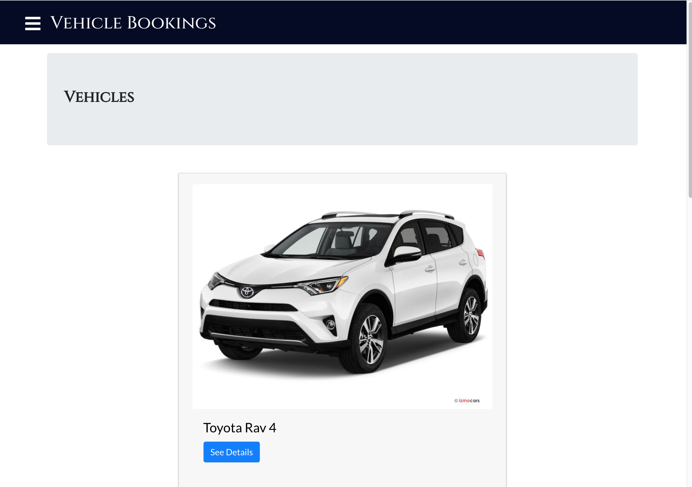

 # Vehicle Booking App
This is a tablet web application built with React for booking vehicles. The data for the app is obtained from [a Rails API](https://github.com/krys2fa/vehicle-booking-api) using axios and stored in the Redux store to be accessed by multiple components.
This project was set up with [Create React App](https://github.com/facebook/create-react-app).

# Screenshot

## Built With
- React.
- React Hooks.
- create-react-app tool.
- Redux.
- Bootstrap.
- [Rails API](https://github.com/krys2fa/vehicle-booking-api).

## Live Demo

Click [here](https://vehicle-booking.netlify.app) to visit a live version of the web app which has been deployed to Netlify.

## Getting Started

To get a local copy up and running follow these simple example steps.

### Prerequisites

- NPM.
- Javascript.
- React.

### Setup
- Clone the repository by running in your `git clone https://github.com/krys2fa/vehicle-booking-app.git` terminal/command line.
- Run `npm install` to install dependencies.
- Run `npm start` to start the development server.

### Testing
To run tests,
- Run `npm test` in the project directory in your terminal/command line.

## Author

👤 **Christopher Amanor**

- Github: [@krys2fa](https://github.com/krys2fa)
- Twitter: [@krys2fa](https://twitter.com/krys2fa)
- Linkedin: [Christopher Amanor](https://www.linkedin.com/in/christopher-amanor/)

## 🤝 Contributing

Contributions, issues and feature requests are welcome!

Feel free to check the [issues page](https://github.com/krys2fa/vehicle-booking-app/issues).

## Show your support

Kindly give this repository a ⭐️ if you like this project!

## Acknowledgments

- Project specifications by [Microverse](https://www.microverse.org) and can be found [here](https://www.notion.so/Final-Capstone-Project-Book-an-Appointment-41ded2ee99ff4fe4becf91acb332ca26).

## 📝 License

This project is licensed under the MIT License.

